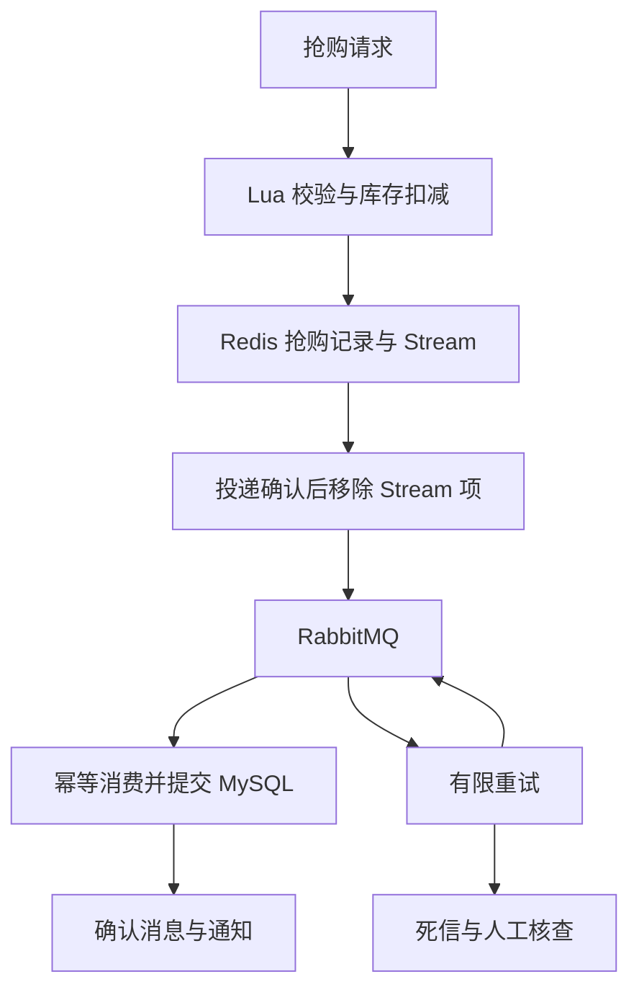

# WebBackend：秒杀与 AI 商品咨询后台

Python 3.12 / FastAPI；网关、用户、商品、秒杀、订单、AI 六个服务，MySQL、Redis、RabbitMQ。仓库起源于课程作业，本版本补齐完整容器部署、库存预留、可靠消息与异常处理。

**性能口径：旧版 QPS 7980 来自 fakeredis / SQLite / 内存队列的进程内模拟测试，不是完整 HTTP 服务吞吐。当前版本没有宣称“真实 10000 网络并发”。** 单元测试、真实集成测试与性能测量分别进行；部署后请按自己的硬件重新测量。

## 一键启动

前置条件：Git、Python 3.12+、Docker Desktop 或 Docker Engine，以及 Docker Compose >= 2.20。主机上的 Python 仅运行标准库启动脚本；无需安装项目依赖。第一次需要网络下载镜像和 Python 依赖。建议先给 Docker 4 GB 可用内存，实际资源是否足够以启动检查为准。

```bash
git clone https://github.com/xrfc/WebBackend_2026SS.git
cd WebBackend_2026SS
python scripts/deploy.py
```

Windows 也可以运行 `start_all.bat`；Linux/macOS 可运行 `sh start_all.sh`。

脚本自动生成 `.env` 随机凭据，构建服务镜像，初始化/升级数据库，创建首个管理员，等待六个服务就绪。**再次启动会复用凭据和数据，不会覆盖已有管理员密码。** 管理员用户名、密码在本机 `.env` 的 `ADMIN_USERNAME`、`ADMIN_PASSWORD` 中；不要提交或分享该文件。

入口：<http://localhost:8000/docs>。这里聚合五个后端的实际接口，支持登录、Authorize、创建商品、创建活动、抢购和查订单。只有网关暴露主机端口，中间件和业务服务通过 Compose 网络通信。

```bash
python scripts/deploy.py status
python scripts/deploy.py logs
python scripts/deploy.py test    # 真实 HTTP + MySQL/Redis/RabbitMQ + WebSocket 验收
python scripts/deploy.py down    # 停止容器，保留三个数据卷
python scripts/deploy.py check   # 检查配置，不启动容器
```

服务器部署时，将 `.env` 的 `GATEWAY_BIND` 设置为要监听的主机地址，例如 `0.0.0.0`，再运行启动命令。默认只监听本机。公网访问应由 HTTPS 反向代理承接，浏览器来源写入 `CORS_ORIGINS`；不要暴露数据库/Redis/MQ端口。镜像标签和 Python 依赖版本记入自己的交付记录，正式发布建议固定镜像 digest。

## 第一次操作顺序

1. `POST /login`：使用 `.env` 管理员账号；复制 `data.token` 到 Swagger 的 Authorize。
2. `POST /products`：例如 `{"name":"测试商品","price":"99.99","stock":10}`。金额以两位小数字符串传入/返回。
3. `POST /seckill/start`：例如 `{"product_id":1,"stock":5,"seckill_price":"0.01","duration_seconds":3600}`。返回独立 `activity_id`；商品可用库存从 10 变成 5。
4. 创建普通用户并登录。新密码至少 8 字符、UTF-8 不超过 72 字节。
5. `POST /seckill/submit`：`{"product_id":1,"activity_id":"上一步的活动UUID"}`。HTTP 202 只代表记录成功，返回 `request_id`。
6. `GET /seckill/requests/{request_id}`：`queued` 等待、`created` 已生成订单、`manual_review` 需处理死信。订单可以通过 `/orders` 查询。
7. 管理员 `POST /seckill/activities/{activity_id}/close`：停止新抢购，将未售出库存释放回商品；重复关闭不会二次释放。活动到期后后台自动执行关闭。

`activity_id` 在抢购接口可省略以兼容旧客户端，但建议总是显式发送，防止商品切换活动后误抢新场次。重复提交同一活动会返回原 `request_id`，不重复扣库存。活动结束后的历史查询仍使用原 `request_id`。

## 可靠下单与故障处理



Lua 在一个脚本中检查活动时间/库存/用户、扣库存、写抢购记录和 Stream outbox。RabbitMQ 断开时保留 Stream，恢复后重投。投递确认与 Stream 移除之间退出可能产生重复消息，所以订单表使用 `request_id` 和 `(activity_id,user_id)` 唯一约束。

消费者只有在数据库提交成功，或者失败消息已确认转入重试/死信队列后，才确认原消息。数据库暂时不可用默认重试 3 次、每次延迟 5 秒；不合法消息直接进入死信。通知发送失败不影响已提交订单，客户端查询是结果依据。

| 边界/极端情况 | 行为 |
|---|---|
| 负库存、布尔库存、超 100000、超范围 ID | HTTP 422，未修改数据库/库存 |
| 0、负金额、NaN、Infinity、超过两位小数 | HTTP 422；金额使用 Decimal 和整数分 |
| 商品不存在、下架、预留库存不足 | 404/409，不能开启活动 |
| 同一商品重复开启活动 | 409，返回已有活动 ID，不重置库存 |
| 同一用户重复抢购 | 返回原请求；只扣一次 |
| 活动未开始/结束、库存耗尽 | 409，不扣库存 |
| Redis 价格缺失、库存损坏、Key 类型异常 | 503，停止受理，不使用零价格兜底 |
| 请求过密 | 429；每用户秒杀默认 30 次/秒 |
| 待投递 Stream 达到上限 | 503，在扣库存前拒绝，默认上限 10000 |
| RabbitMQ 停止 | 已受理请求留在 Stream，恢复后重投 |
| 消费消息重复 | 唯一约束保证一张订单 |
| 消费失败/重试耗尽 | 有限重试或死信，结果待核查，不盲目退库存 |
| Redis 活动状态遗失 | 已开启活动不自动按初始库存重建，暂停受理/库存释放 |
| 超 64 KiB 请求体、过长字段 | 413/422；Uvicorn 并发也设上限 |
| Token 过期/注销；订阅别人的 WebSocket | 401 或关闭连接 |
| AI 未配置/超时/过载 | 明确返回 `degraded:true` 及原因，不伪装模型调用成功 |

完整原理、恢复操作和边界见 [docs/异常处理与部署说明.md](docs/异常处理与部署说明.md)。

## WebSocket 与 AI

连接 `ws://localhost:8000/ws/{自己的user_id}`，连接后 5 秒内发送 `{"token":"登录Token"}`，收到 `connected` 后等待订单通知。也支持原生客户端的 Authorization header。网关转发 WebSocket；订单服务从认证结果核对用户身份，最多每用户 5 条连接，每条通知队列最多 32 条。Token 注销/过期会在下一次消息或最多 20 秒检查时关闭连接。跨订单实例通知使用 Redis Pub/Sub；通知不能替代持久结果查询。

AI 默认可不配置。填写 `.env` 的 `LLM_API_KEY`、`LLM_BASE_URL`、`LLM_MODEL` 后重新启动；使用 OpenAI 兼容接口，限制等待与并发，不做无穷重试。商品库存显示的是可用商品库存；秒杀库存请查询秒杀接口。AI 成功与降级通过 `degraded` 字段区分。

## 测试

```bash
# 本机单元/边界/模拟故障测试
pip install -r requirements-dev.txt
python -m pytest -q
# 或旧入口：python test_integration.py

# 完整 Docker 集成验收
python run_and_test.py
```

GitHub Actions 包含单元测试、完整 Compose 启动、真实 HTTP/MQ/WebSocket 测试、订单/秒杀服务重启后的验收，以及 RabbitMQ 停止期间受理并恢复落库的两阶段故障实验。测试产生独立测试用户与商品，请在隔离测试环境执行，尤其是死信与停服务实验。

单元测试使用 fakeredis/SQLite；真实测试使用实际容器、HTTP 与 MQ，不再把验收项固定为 True。所有失败都返回非零退出码。真实 Redis Lua 的额外本机用例需要专用测试实例 `redis://127.0.0.1:6397/15`，不得指向业务实例。

## 已有数据升级与边界

首次升级先备份数据库和 `.env`。`db-init` 会保留原用户/商品/订单，为旧订单增加可空的请求/活动字段与唯一索引，并将 MySQL 浮点金额转为 DECIMAL(12,2)，历史金额会按分舍入。MySQL DDL 不保证整个升级原子回滚；失败后检查日志、修正数据，再重跑幂等初始化，不使用 `down -v` 删除数据。

本版本拒绝没有 `jti` 的旧 Token，需要重新登录。现有管理员的密码不会自动重置；原默认管理员密码应自行更换。旧 Redis 秒杀 Key 无法当作新版活动的可靠凭据；升级前先停止旧秒杀并核对未完成订单。旧 MQ 消息若缺新版字段会保留到死信，不能凭空补造库存或活动关系。

这是单机可交付的学习项目，Redis AOF、持久卷、确认与幂等降低常见故障风险；单节点磁盘损坏/丢失、管理员删除卷、Redis持久化故障仍需备份和人工对账。请求记录保留至活动结束后 7 天，Stream 不主动裁剪未投递记录；超过保留期的异常积压需人工核查。暂无真实支付/自动支付超时退款，也没有已验证的大规模生产容量承诺。
